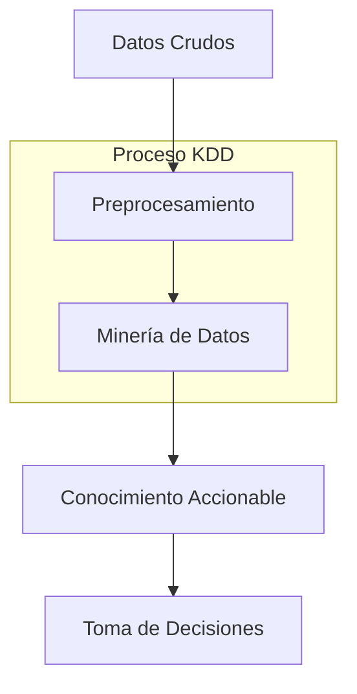
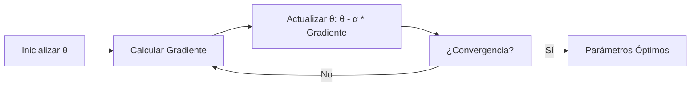
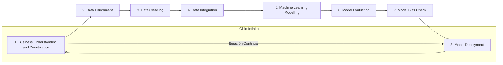
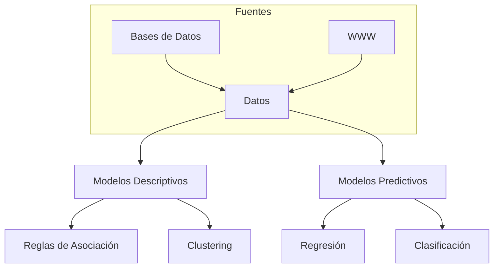
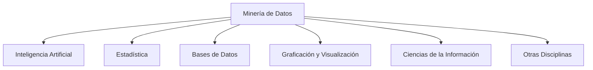
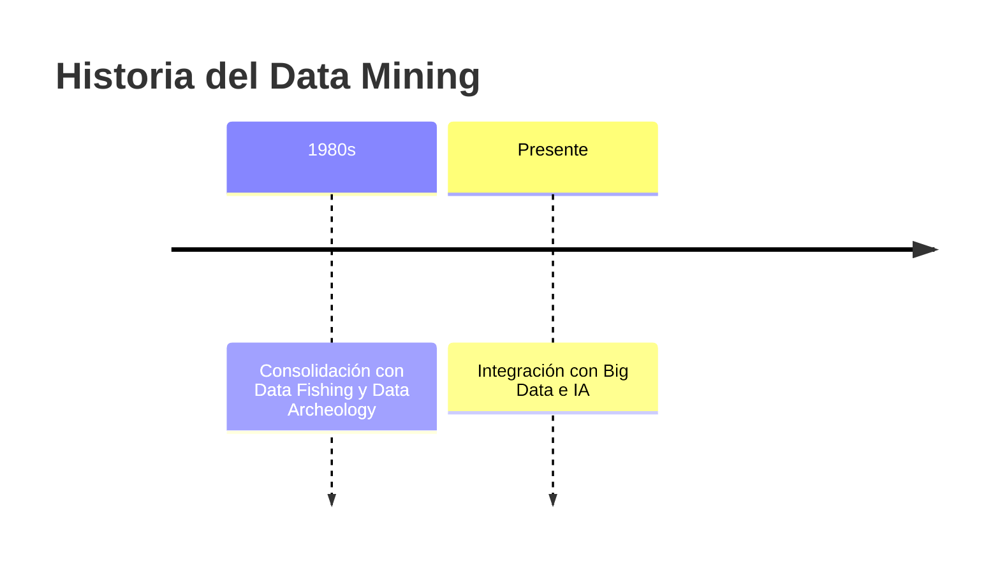
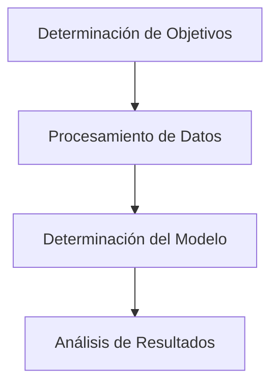
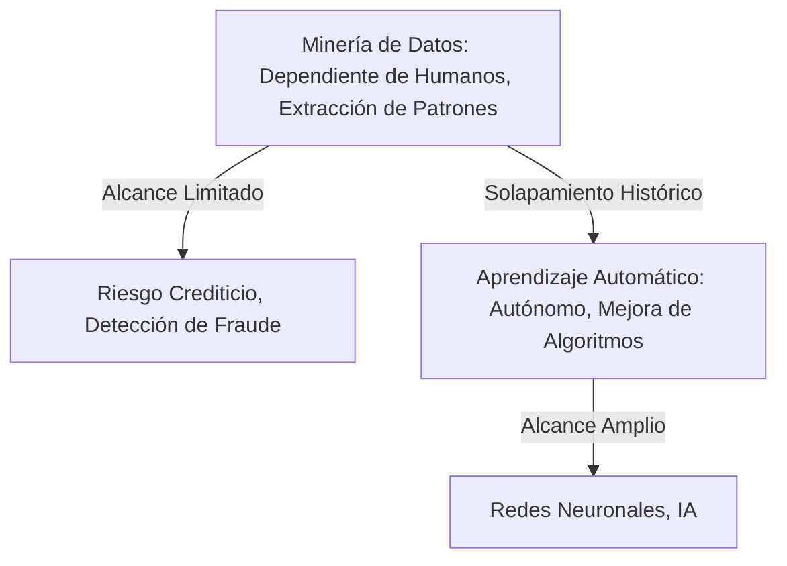
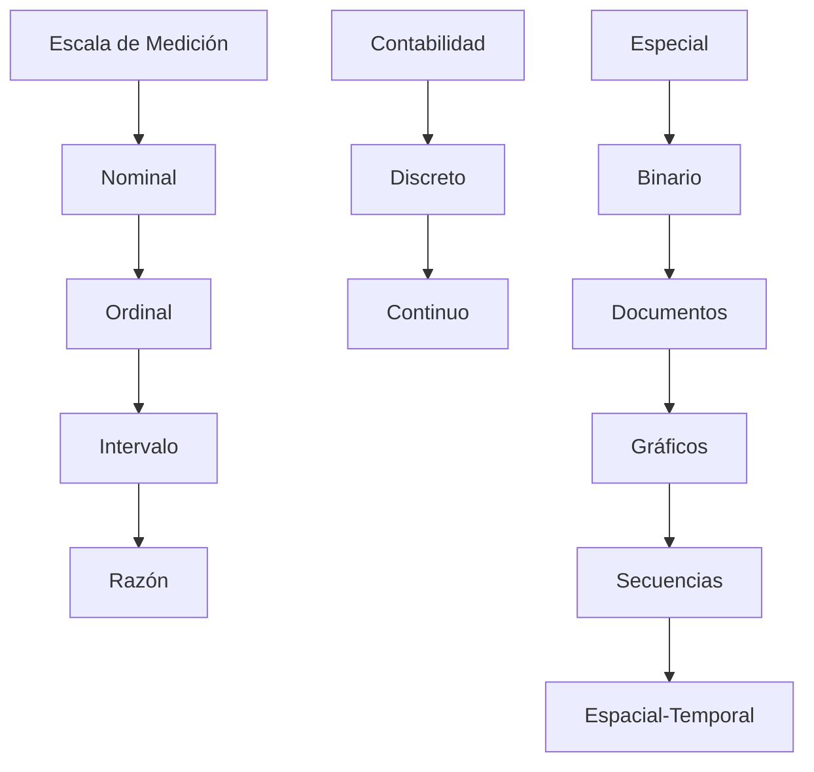
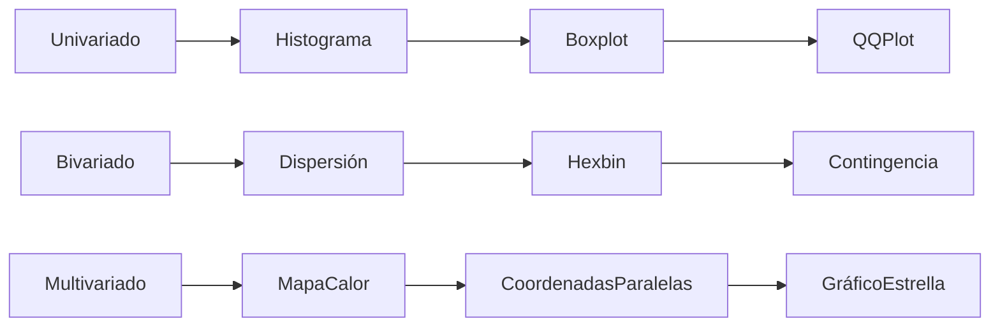

# Sesión 01: Introducción a la Minería de Datos y Regresión Lineal

## Introducción a la Minería de Datos

La minería de datos (Data Mining) consiste en el proceso de descubrir patrones, correlaciones y conocimientos útiles a partir de grandes conjuntos de datos. Implica la transformación de datos crudos en información accionable y conocimiento, facilitando la toma de decisiones en diversos campos como los negocios, la ciencia y la tecnología. Este proceso se enmarca dentro de disciplinas más amplias como el Aprendizaje Automático (Machine Learning) y la Inteligencia de Negocios (Business Intelligence).

### Categorías de Datos
Los datos se clasifican según su estructura y formato, lo que influye en las técnicas de análisis aplicadas:

- **Datos Estructurados**: Organizados en formatos tabulares con filas y columnas bien definidas, como bases de datos relacionales. Ejemplos incluyen tablas en SQL con campos como ID, nombre, edad y salario. Son fáciles de consultar y analizar mediante consultas estándar.
- **Datos Semi-estructurados**: Contienen alguna estructura, pero no tan rígida como los estructurados. Incluyen formatos como HTML, XML, JSON o archivos de log, donde los datos tienen etiquetas o jerarquías, pero pueden variar en esquema.
- **Datos No Estructurados**: Carecen de formato predefinido, lo que complica su análisis directo. Ejemplos son archivos multimedia como MP3, videos, imágenes, texto libre (e.g., correos electrónicos, documentos PDF) o datos de sensores. Requieren técnicas avanzadas como procesamiento de lenguaje natural (NLP) o visión por computadora para extraer información.

### Relación con Otras Disciplinas
- **Business Intelligence (BI)**: Enfocada en el análisis de datos para apoyar decisiones empresariales. Incluye herramientas para reporting, dashboards y análisis descriptivo. La minería de datos extiende BI hacia análisis predictivos y prescriptivos.
- **Analytics**: Subdividido en:
  - **Descriptive Analytics**: Describe qué ha sucedido (e.g., resúmenes estadísticos).
  - **Diagnostic Analytics**: Explica por qué sucedió algo (e.g., análisis de causas raíz).
  - **Predictive Analytics**: Predice qué podría suceder (e.g., modelos de forecasting).
  - **Prescriptive Analytics**: Recomienda acciones para optimizar resultados (e.g., optimización operativa).
- **Knowledge Discovery in Databases (KDD)**: Proceso iterativo que incluye selección de datos, preprocesamiento, transformación, minería y evaluación. La minería de datos es una etapa clave dentro de KDD.
- **Machine Learning (ML)**: Subcampo de la IA que permite a los sistemas aprender de los datos sin programación explícita. Incluye algoritmos supervisados (e.g., regresión), no supervisados (e.g., clustering) y de refuerzo.

### Herramientas Comunes
- **SQL Server BI**: Para integración de servicios (SSIS), análisis (SSAS) y reporting (SSRS).
- **Tableau**: Visualización interactiva de datos.
- **Power BI**: Herramienta de Microsoft para dashboards y análisis.
- **R y Python**: Lenguajes para scripting analítico, con librerías como pandas, scikit-learn y ggplot.



## Regresión Lineal Univariada

La regresión lineal es un algoritmo de aprendizaje supervisado utilizado para predecir una variable dependiente (target) basada en una o más variables independientes (features). En la versión univariada, se utiliza una sola feature.

### Componentes Clave
- **Variables**:
  - **Independiente (Feature/Predictor)**: Variable de entrada, denotada como $x$. Ejemplo: tamaño de una casa en metros cuadrados.
  - **Dependiente (Target)**: Variable de salida a predecir, denotada como $y$. Ejemplo: precio de la casa.
- **Función Hipótesis**: Modelo que aproxima la relación entre $x$ e $y$. Para regresión lineal:  
  $h_\theta(x) = \theta_0 + \theta_1 x$  
  Donde $\theta_0$ es el intercepto (bias) y $\theta_1$ es la pendiente (weight).
- **Función de Costo**: Mide el error del modelo. Comúnmente se usa el Error Cuadrático Medio (MSE):  
  $J(\theta_0, \theta_1) = \frac{1}{2m} \sum_{i=1}^{m} (h_\theta(x^{(i)}) - y^{(i)})^2$  
  Donde $m$ es el número de ejemplos de entrenamiento.

### Ejemplo de Dataset
| Área (m²) | Precio ($) |
|-----------|------------|
| 50        | 100000     |
| 80        | 150000     |
| 100       | 180000     |
| ...       | ...        |

En este caso, el área es la feature y el precio es el target.

```mermaid
graph LR
    A[Feature: Área] --> B[Modelo: h(θ)] --> C[Predicción: Precio]
    subgraph Gráfico de Regresión
    D[Scatter Plot de Datos] --> E[Línea de Regresión]
    end
```

### Optimización de Parámetros
Los parámetros $\theta$ se ajustan para minimizar $J(\theta)$. Esto se discute en detalle en la sesión siguiente.

# Sesión 02: Regresión Polinomial y Descenso del Gradiente

## Regresión Polinomial

La regresión polinomial extiende la regresión lineal para capturar relaciones no lineales, modelando la hipótesis como un polinomio de grado superior. Es útil cuando los datos no siguen una línea recta, como en curvas cuadráticas o cúbicas.

### Componentes Clave
- **Función Hipótesis**: Para un polinomio de grado 2:  
  $h_\theta(x) = \theta_0 + \theta_1 x + \theta_2 x^2$  
  Puede extenderse a grados superiores, pero se debe evitar el sobreajuste (overfitting) mediante regularización.
- **Función de Costo**: Igual que en la regresión lineal:  
  $J(\theta) = \frac{1}{2m} \sum_{i=1}^{m} (h_\theta(x^{(i)}) - y^{(i)})^2$
- **Ventajas y Desventajas**:
  - Ventajas: Captura complejidades no lineales; sigue siendo lineal en parámetros (puede resolverse con métodos lineales).
  - Desventajas: Sensible al sobreajuste en grados altos; requiere normalización de features.

### Máximos Locales y Mínimos Globales
La superficie de costo $J(\theta)$ puede tener:
- **Máximos Locales**: Puntos donde el costo es mayor que en vecinos inmediatos, pero no el máximo global.
- **Mínimos Locales**: Puntos de bajo costo local, pero posiblemente no el óptimo global.
- **Mínimo Global**: El punto de costo más bajo, ideal para el modelo.

```mermaid
graph TD
    A[Superficie de Costo J(θ)] --> B[Mínimo Local]
    A --> C[Mínimo Global]
    A --> D[Máximo Local]
    subgraph Gráfico 3D
    E[Eje θ0] -- Eje θ1 --> F[Valores de J]
    end
```

## Descenso del Gradiente

El descenso del gradiente es un algoritmo de optimización iterativo para encontrar los parámetros $\theta$ que minimizan la función de costo. Es especialmente útil en datasets grandes donde soluciones analíticas (e.g., ecuación normal) son computacionalmente costosas.

### Fórmula de Actualización
Para cada parámetro $j$:  
$\theta_j := \theta_j - \alpha \frac{\partial J(\theta)}{\partial \theta_j}$  
Donde:
- $\alpha$: Tasa de aprendizaje (learning rate), un hiperparámetro que controla el tamaño de los pasos.
- $\frac{\partial J}{\partial \theta_j}$: Derivada parcial, indica la dirección del ascenso más pronunciado.

### Efecto de la Tasa de Aprendizaje ($\alpha$)
- **$\alpha$ Pequeño**: Convergencia lenta pero estable; riesgo de estancamiento en mínimos locales.
- **$\alpha$ Grande**: Pasos grandes que pueden overshoot el mínimo; posible divergencia o oscilación.

### Derivadas Parciales para Regresión Lineal
- Para $\theta_0$: $\frac{\partial J}{\partial \theta_0} = \frac{1}{m} \sum_{i=1}^{m} (h_\theta(x^{(i)}) - y^{(i)})$
- Para $\theta_1$: $\frac{\partial J}{\partial \theta_1} = \frac{1}{m} \sum_{i=1}^{m} (h_\theta(x^{(i)}) - y^{(i)}) \cdot x^{(i)}$

### Proceso Iterativo
Se repite hasta convergencia (e.g., cuando el cambio en $J$ es mínimo). Para funciones convexas como MSE, garantiza el mínimo global.



### Consideraciones Adicionales
- **Normalización de Features**: Escalar variables para acelerar convergencia (e.g., media 0, desviación 1).
- **Variantes**: Batch (todo el dataset), Stochastic (un ejemplo por iteración), Mini-batch (subconjuntos).
- **Hiperparámetros**: Además de $\alpha$, incluye número de iteraciones y umbral de convergencia.

# Ciclo de Vida de los Datos: Data LifeCycle.pdf

## Introducción al Ciclo de Vida de los Datos

El ciclo de vida de los datos representa el proceso iterativo y continuo mediante el cual los datos son gestionados desde su concepción hasta su utilización práctica en modelos analíticos. Este ciclo, a menudo ilustrado como un bucle infinito, enfatiza la naturaleza cíclica del manejo de datos en entornos de minería de datos y aprendizaje automático. El diagrama proporcionado en el documento destaca ocho etapas clave, asegurando que los datos sean refinados, modelados y desplegados de manera efectiva para apoyar decisiones empresariales.

### Etapas Principales del Ciclo de Vida

- **Business Understanding and Prioritization**: Identificar los objetivos empresariales y priorizar las necesidades de datos. Esta etapa implica comprender el contexto del negocio, definir problemas específicos y alinear los esfuerzos de datos con metas estratégicas. Por ejemplo, determinar si el foco está en predecir churn de clientes o optimizar inventarios.
  
- **Data Enrichment**: Enriquecer los datos existentes mediante la incorporación de fuentes adicionales. Esto incluye la integración de datos externos, como APIs o bases de datos complementarias, para aumentar la profundidad y relevancia. Mejora la calidad al agregar variables que podrían revelar patrones ocultos.

- **Data Cleaning**: Limpiar los datos para eliminar errores, duplicados, valores atípicos o inconsistencias. Técnicas comunes incluyen el manejo de valores faltantes (imputación), normalización y detección de outliers. Esta etapa es crucial para evitar sesgos en modelos subsiguientes.

- **Data Integration**: Integrar datos de múltiples fuentes en un conjunto unificado. Involucra la resolución de conflictos de formato, esquemas y semántica, utilizando herramientas como ETL (Extract, Transform, Load). Asegura una vista holística de los datos.

- **Machine Learning Modelling**: Desarrollar modelos de aprendizaje automático basados en los datos preparados. Incluye la selección de algoritmos (e.g., regresión, clustering) y entrenamiento inicial. El enfoque está en crear modelos que capturen patrones predictivos o descriptivos.

- **Model Evaluation**: Evaluar el rendimiento del modelo utilizando métricas como precisión, recall, F1-score o RMSE. Implica técnicas como validación cruzada para asegurar generalización y evitar sobreajuste.

- **Model Bias Check**: Verificar sesgos en el modelo, como discriminación por género o raza. Utiliza auditorías de equidad y métricas como disparate impact para mitigar riesgos éticos y legales.

- **Model Deployment**: Desplegar el modelo en producción, integrándolo en sistemas operativos. Incluye monitoreo continuo, actualizaciones y escalabilidad para manejar cargas reales.

### Representación Visual del Ciclo

El diagrama adopta una forma de infinito (∞), simbolizando la iteratividad: los resultados de deployment pueden retroalimentar nuevas priorizaciones empresariales.



## Mejoras y Expansiones

- **Importancia en Minería de Datos**: Este ciclo alinea con estándares como CRISP-DM, extendiendo el enfoque a sesgos y despliegue, críticos en era de IA ética.
- **Herramientas Recomendadas**:
  - Limpieza: Pandas, OpenRefine.
  - Modelado: Scikit-learn, TensorFlow.
  - Despliegue: Docker, Kubernetes.
- **Desafíos Comunes**: Manejo de datos sensibles (cumplimiento GDPR), escalabilidad en big data y mantenimiento de modelos en entornos dinámicos.

# Acerca de la Minería de Datos: Acerca de la Minería de Datos.pdf

## Definiciones Iniciales

La minería de datos se basa en conceptos fundamentales que distinguen entre datos crudos y conocimiento derivado.

- **Datos**: Hechos o medidas que describen características de objetos, eventos o personas. Representan la materia prima para obtener información.
- **Información**: Datos analizados y presentados de forma adecuada, relevantes para un observador en un momento específico.
- **Conocimiento**: Información procesada para emitir juicios que llevan a conclusiones.
- **Meta Conocimiento**: Reglas que permiten obtener conocimiento.

### Características Principales de la Información

- **Significado (Semántica)**: ¿Qué quiere decir? Influye en las actitudes y acciones basadas en consecuencias previsibles.
- **Importancia (Relativa al Receptor)**: ¿Trata sobre una cuestión importante? Mide el cambio en actitud o conducta.
- **Vigencia (Dimensión Espacio-Tiempo)**: ¿Es actual o desfasada? Difícil de evaluar sin contexto adicional.
- **Validez (Relativa al Emisor)**: ¿El emisor es fiable? ¿Puede entregar información no válida?
- **Valor (Receptor)**: ¿Cuán útil resulta para el destinatario?

## Situación Actual de los Datos

La revolución digital ha facilitado la captura y almacenamiento de datos a bajo costo, generando volúmenes masivos en bases de datos diarias. Sin embargo, las herramientas tradicionales de gestión y estadísticas son inadecuadas para analizar estos datos. Los datos solos no producen beneficios; su valor radica en extraer información para la toma de decisiones. Procesos manuales son irrealizables con bases de datos de 10^9 registros y 10^3 dimensiones. La minería de datos automatiza este proceso.

## Conocimiento: Modelo vs. Patrón

Según Hand, Mannila y Smyth:
- **Modelo**: Describe todo el conjunto de datos (e.g., una línea de regresión global).
- **Patrón**: Se enfoca en una región particular de datos (e.g., un outlier o subgrupo).

### Fuentes de Datos y Tipos de Modelos

- **Fuentes de Datos**:
  - Bases de datos (relacionales, espaciales, temporales, documentales, multimedia).
  - World Wide Web.

- **Modelos Descriptivos**: Identifican patrones que explican o resumen datos.
  - Reglas de asociación.
  - Clustering.

- **Modelos Predictivos**: Estiman valores de variables de interés a partir de otras.
  - Regresión.
  - Clasificación.



## Visión Simplificada de la Minería de Datos

Los modelos son el producto principal de la minería de datos, soportando estrategias de decisión.


## Definiciones de Minería de Datos

- Proceso de identificar conocimiento válido, novedoso, útil y comprensible de bases de datos (Fayyad et al., 1996).
- Exploración y análisis de grandes cantidades de datos para encontrar patrones significativos.
- Mecanismo de búsqueda de información valiosa en volúmenes masivos, ligado a bodegas de datos históricos.
- Análisis para encontrar relaciones no triviales y resumir datos de manera entendible (Hand, Mannila y Smyth).
- Extracción de patrones interesantes y útiles de grandes bases de datos (Hand).
- Proceso de extraer conocimiento útil y comprensible de datos en diversos formatos (Witten and Frank, 2000).
- Proceso no trivial de identificar patrones válidos, novedosos y comprensibles (KDD).

## Lo que Es y No Es Minería de Datos

- **Sí Es**:
  - Proceso de inferir relaciones importantes de datos crudos.
  - Colección de técnicas para analizar volúmenes grandes.
  - Conjunto de técnicas que descubren relaciones no previamente conocidas.
  - Palabra de moda para técnicas que encuentran patrones.

- **No Es**:
  - Búsqueda simple en directorios o motores de búsqueda.
  - Fuerza bruta en datos a granel.
  - Presentación de datos en diferentes formas.
  - Tarea intensiva de base de datos básica.

## Campo Multidisciplinario

La minería de datos integra:
- Inteligencia Artificial (Machine Learning).
- Estadística.
- Bases de Datos.
- Graficación y Visualización.
- Ciencias de la Información.
- Otras disciplinas.



## Minería de Datos vs. Estadística

| Aspecto          | Estadística                          | Minería de Datos                     |
|------------------|--------------------------------------|--------------------------------------|
| Construcción de Modelos | Ceñida a premisas y teoremas        | Mayor libertad, interpretable        |
| Búsqueda         | Test de la razón de verosimilitud   | Metaheurísticos                      |
| Transparencia    | Más complicados de interpretar      | Más claros y sencillos               |
| Validación       | No                                  | Sí                                   |

Adicionalmente, la minería maneja mayor volumen y complejidad de datos, enfatizando la búsqueda de modelos sobre la verificación.

## OLAP vs. Minería de Datos

| Ejemplo OLAP                          | Ejemplo Minería de Datos              |
|---------------------------------------|--------------------------------------|
| ¿Proporción media de accidentes entre fumadores/no fumadores? | ¿Mejor predicción para accidentes?   |
| ¿Factura telefónica media de clientes/abandonados? | ¿Dejará X la compañía? ¿Factores que afectan abandonos? |
| ¿Compra media diaria de tarjetas robadas/légitimas? | ¿Patrones de compra asociados con fraude? |

OLAP ofrece vistas descriptivas actuales, pero no predice futuro ni explica causas.

## Clasificación de la Minería de Datos

- **Métodos Descriptivos**: Encuentran patrones interpretables que describen datos.
- **Métodos de Predicción**: Usan variables para predecir valores desconocidos o futuros.

Se divide en:
- Minería Predictiva (MDP): Primordialmente técnicas estadísticas.
- Minería para Descubrimiento de Conocimiento (MDDC): Principalmente inteligencia artificial.

## Mejoras y Expansiones

- **Aplicaciones Prácticas**: En marketing para segmentación, en salud para diagnósticos predictivos.
- **Desafíos Éticos**: Privacidad de datos, sesgos en modelos.
- **Tendencias Actuales**: Integración con big data, cloud computing y ética en IA.

# ¿Qué es el Data Mining?: Qué es Data Mining.pdf

## Definición y Propósito

El Data Mining, o Minería de Datos, es un campo de la estadística y ciencias de la computación que involucra procesos automáticos o semiautomáticos para explorar grandes conjuntos de datos. Su objetivo es identificar patrones, anomalías y comportamientos que expliquen los datos, facilitando estrategias empresariales como adquisición y fidelización de clientes.

La creación de grandes bases de datos genera "infoxicación"; el Data Mining estructura estos datos para extraer valor, prediciendo tendencias y mejorando decisiones.

### Historia

Aunque parece reciente, se consolidó en los 80s junto con Data Fishing y Data Archeology. Surgió para comprender volúmenes masivos de datos y apoyar el crecimiento empresarial.



## Minero de Datos

Los profesionales, conocidos como "Mineros o Exploradores de Datos", descubren patrones en masas de datos para proporcionar información valiosa. Pasos clave:

- **Determinación de Objetivos**: El cliente define metas.
- **Procesamiento de Datos**: Selección, limpieza, organización y reducción.
- **Determinación del Modelo**: Estudio estadístico y visualización gráfica.
- **Análisis de Resultados**: Identificar coherencia y utilidad.

Aplicado en salud, banca, medios y retail; una profesión con alta proyección.



## Data Mining vs. Big Data

Ambos manejan grandes datos, pero difieren:

- **Objetivos**: Big Data se enfoca en almacenamiento; Data Mining en extracción de valor.
- **Herramientas**: Data Mining usa IA y estadísticas; Big Data requiere software no convencional.
- **Resultados**: Data Mining produce modelos predictivos; Big Data complica predicciones sin herramientas especiales.

Big Data es el "activo"; Data Mining, el "manejo".

| Aspecto      | Big Data                  | Data Mining               |
|--------------|---------------------------|---------------------------|
| Herramientas | Software no convencional | IA y Métodos Estadísticos |
| Resultados   | Gestión de información   | Modelos predictivos       |

## Ejemplos de Uso

- **Marketing**: Analizar parámetros (edad, género, gustos) para predecir comportamiento y churn.
- **Supermercados**: Identificar asociaciones de productos y optimizar colocación para aumentar ventas.
- **Bancos**: Analizar transacciones, patrones de compra para evaluar riesgos y preferencias.
- **Medicina**: Usar historiales para diagnósticos precisos y agilizar gestión administrativa.

## Conclusión

El Data Mining ofrece infinitas posibilidades en Data Science y Big Data, con demanda creciente.

## Mejoras y Expansiones

- **Técnicas Avanzadas**: Incorporar deep learning para patrones complejos.
- **Consideraciones Éticas**: Asegurar privacidad y equidad en aplicaciones sensibles.
- **Herramientas Modernas**: Python (Scikit-learn), R para implementación práctica.

# Data Mining vs Machine Learning: Data Mining vs Machine Learning.pdf

## Introducción

El documento examina las distinciones entre minería de datos y aprendizaje automático, dos conceptos a menudo confundidos debido a su dependencia compartida en el análisis de datos. Proporciona definiciones, contexto histórico y comparaciones detalladas para aclarar sus roles únicos en el paisaje digital.

## Definiciones

- **Minería de Datos**: Este proceso implica extraer información valiosa, precisa y significativa de conjuntos de datos extensos. Sirve como herramienta operada por humanos para identificar información relevante que apoya la toma de decisiones organizacionales o individuales.

- **Aprendizaje Automático**: Este campo se centra en la creación, análisis y refinamiento de algoritmos que mejoran su rendimiento a través de experiencias derivadas de datos. Permite a las máquinas aprender de manera independiente, reduciendo la necesidad de supervisión humana más allá de la configuración inicial.

## Orígenes Históricos

- **Minería de Datos**: Originada en los años 1930, inicialmente conocida como Descubrimiento de Conocimiento en Bases de Datos (KDD). Se refiere como KDD en ciertos contextos incluso hoy.

- **Aprendizaje Automático**: Surgió en los años 1950, con una demostración temprana en un programa diseñado para jugar damas.

## Diferencias Clave

El documento describe varias distinciones, organizadas para mayor claridad:

- **Propósito**:
  - La minería de datos busca derivar reglas y patrones de grandes volúmenes de datos para lograr resultados específicos.
  - El aprendizaje automático equipa sistemas para interpretar parámetros y acumular experiencia, facilitando la ejecución de tareas complejas.

- **Entradas y Dependencias**:
  - La minería de datos opera sobre datos crudos y voluminosos (como Big Data) para generar pronósticos.
  - El aprendizaje automático utiliza principalmente algoritmos, que procesan datos para fomentar mejoras.

- **Participación Humana**:
  - La minería de datos requiere intervención humana continua para configurar parámetros e interpretar resultados; no puede funcionar sin engagement del usuario.
  - El aprendizaje automático es predominantemente autónomo después de la inicialización, encarnando un enfoque de "configurar y olvidar".

- **Interrelación**:
  - La minería de datos integra gestión de bases de datos con técnicas de aprendizaje automático para análisis.
  - El aprendizaje automático puede aprovechar insights de minería de datos para identificar conexiones relacionales, pero no lo requiere.

- **Adaptabilidad**:
  - La minería de datos se adhiere a reglas estáticas predefinidas y carece de capacidad para auto-adaptación.
  - El aprendizaje automático refina dinámicamente algoritmos en respuesta a condiciones emergentes.

- **Aplicaciones**:
  - Minería de datos: Se aplica en retail para analizar comportamientos de compra y optimizar ventas, en redes sociales para publicidad dirigida mediante análisis de perfiles y palabras clave, y en finanzas para evaluar oportunidades de inversión y viabilidad de startups.
  - Aprendizaje automático: Apoya innovaciones como vehículos autónomos, detección de fraude en transacciones de crédito, filtrado de spam en correos electrónicos, inteligencia de negocios para gestión de transacciones, y marketing personalizado en plataformas como Yelp, Twitter, Facebook, Pinterest, Salesforce y Google.

## Similitudes

Ambas disciplinas residen dentro del dominio de la ciencia de datos y abordan la resolución de problemas complejos. Emplean algoritmos superpuestos para reconocimiento de patrones. La minería de datos puede proporcionar información procesada para mejorar procesos de aprendizaje automático, aunque esta integración es opcional en lugar de esencial.

```mermaid
venn
  Minería de Datos -->|Extrae Patrones de Datos Crudos| Superposición[Algoritmos Compartidos para Descubrimiento de Patrones]
  Aprendizaje Automático -->|Aprende Autónomamente de Datos| Superposición
  Superposición --> CienciaDatos[Paraguas de Ciencia de Datos]
```

## Tabla Comparativa

| Aspecto              | Minería de Datos                              | Aprendizaje Automático                         |
|---------------------|------------------------------------------|------------------------------------------|
| Enfoque               | Descubrimiento de patrones ocultos o conocimiento de datos | Desarrollo de algoritmos que aprenden de datos |
| Objetivo                | Extraer insights e información de conjuntos de datos existentes | Construir modelos para predicciones o tareas |
| Uso               | Identificación de patrones, tendencias y anomalías | Modelado predictivo, clasificación, clustering |
| Entrada               | Datos históricos o grandes conjuntos        | Datos etiquetados o no etiquetados para entrenamiento   |
| Salida              | Conocimiento en forma de patrones o reglas | Predicciones, clasificaciones, recomendaciones |
| Métodos             | Estadísticas descriptivas, clustering, reglas de asociación | Árboles de decisión, regresión, redes neuronales, SVM |
| Alcance               | Análisis amplio de varios tipos de datos   | Enfocado en aplicaciones de modelos específicos   |
| Dominio              | Negocios, marketing, salud          | IA, robótica, reconocimiento de patrones        |

## Mejoras y Correcciones

- El documento menciona un video sobre conceptos básicos de aprendizaje automático, que puede complementarse con recursos como el curso de Andrew Ng en Coursera para una comprensión más profunda.
- Correcciones: La línea de tiempo histórica es precisa, pero note que la minería de datos moderna a menudo incorpora aprendizaje automático como subconjunto, refinando la afirmación de "precede por dos décadas" para reconocer solapamiento evolutivo.
- Expansiones: Consideraciones éticas, como privacidad de datos en minería y sesgos en algoritmos de aprendizaje, son críticas en aplicaciones contemporáneas. Herramientas como scikit-learn de Python puentean ambos campos de manera efectiva.

# Minería de Datos versus Aprendizaje Automático: Data Mining versus Machine Learning.pdf

## Resumen

Este documento conciso presenta una comparación tabular entre minería de datos y aprendizaje automático, enfatizando diferencias procedimentales, históricas y aplicativas. Complementa el análisis más detallado en materiales relacionados, evitando redundancias al enfocarse en frases únicas y resúmenes estilo infografía.

## Distinciones Clave

- **Enfoque Procedimental**:
  - La minería de datos implica buscar datos almacenados (a menudo en entornos de nube) para tendencias y patrones más allá del análisis básico, también conocida como Descubrimiento de Conocimiento en Datos (KDD).
  - El aprendizaje automático extrae datos y refina algoritmos a través de mejoras experienciales.

- **Contexto Histórico**:
  - Minería de datos data de los años 1930 como KDD.
  - Aprendizaje automático se introdujo en 1950.

- **Mecánicas Operativas**:
  - Minería de datos revela reglas de datos existentes y maneja datos no estructurados usando bases de datos tradicionales.
  - Aprendizaje automático instruye a las computadoras para comprender y aprender reglas, incorporando algoritmos junto con datos.

- **Aplicaciones**:
  - Minería de datos: Gestión de riesgo crediticio, marketing de bases de datos, detección de fraude.
  - Aprendizaje automático: Redes neuronales, árboles de decisión, diversos dominios de inteligencia artificial.

- **Rol Humano y Alcance**:
  - Minería de datos demanda interferencia humana y opera en un modo manual, con alcance limitado.
  - Aprendizaje automático es automatizado, auto-implementado y aplicable en un rango vasto.

## Tabla Comparativa Estilo Infografía

| Minería de Datos                                      | Aprendizaje Automático                                 |
|--------------------------------------------------|--------------------------------------------------|
| Proceso de búsqueda de datos almacenados para tendencias y patrones | Procedimiento de extracción de datos y mejora de algoritmos vía experiencia |
| Iniciado en 1930 como KDD                          | Introducido en 1950                               |
| Revela reglas de datos existentes               | Instruye a la computadora para entender y aprender reglas    |
| Maneja datos no estructurados con bases de datos tradicionales | Incluye algoritmos así como datos existentes     |
| Usado en gestión de riesgo crediticio, marketing de bases de datos, detección de fraude | Implementado en redes neuronales, árboles de decisión, áreas de IA |
| Requiere interferencia humana, modo manual         | Sin esfuerzo humano, automatizado                       |
| Restringido a área limitada                       | Amplio para aplicaciones                             |



## Mejoras y Correcciones

- Correcciones: La afirmación del documento de que la minería de datos está "restringida a un área limitada" es relativa; en la práctica, escala con tecnologías de big data como Hadoop.
- Expansiones: La integración con computación en nube (e.g., AWS, Azure) mejora ambos, pero la automatización del aprendizaje automático se alinea mejor con sistemas en tiempo real. Para implementación práctica, se recomiendan bibliotecas como TensorFlow para aprendizaje automático y RapidMiner para minería de datos.

# Conociendo los Datos: Conociendo los datos.pdf

## Introducción

Esta extensa presentación de diapositivas, derivada de "Introduction to Data Mining" de Tan, Steinbach y Kumar (2005), explora los fundamentos de los datos en contextos de minería. Cubre tipos de datos, métodos de almacenamiento, métricas de exploración y visualizaciones. Dado el truncamiento, este Markdown completa el contenido basado en el capítulo del libro, corrigiendo inconsistencias y expandiendo con insights prácticos.

## Entendiendo los Datos

Los datos consisten en colecciones de objetos y sus atributos.

- **Objetos**: Entidades como registros, puntos o instancias.
- **Atributos**: Características o variables que describen objetos (e.g., altura, color).

Ejemplo: Un conjunto de datos para detección de fraude fiscal con atributos como Reembolso, Estado Civil, Ingreso Gravable y Fraude.

## Valores y Propiedades de Atributos

- Los valores son numéricos o simbólicos.
- Los mismos valores pueden diferir en significado entre atributos (e.g., ID vs. edad, ambos enteros pero con propiedades distintas).
- Distinciones: Atributos pueden compartir conjuntos de valores pero variar en operaciones (e.g., adición válida para algunos, no para otros).

## Tipos de Datos y Atributos

- **Por Escala de Medición**:
  - Nominal: Categorías sin orden (e.g., género).
  - Ordinal: Categorías ordenadas (e.g., nivel educativo).
  - Intervalo: Numérico con unidades iguales, sin cero verdadero (e.g., fechas de calendario).
  - Razón: Numérico con cero verdadero (e.g., temperatura en Kelvin).

- **Por Contabilidad**:
  - Discreto: Finito/contable (e.g., número de hijos).
  - Continuo: Infinito (e.g., tiempo).

- **Tipos Especiales**: Binario (nominal de dos estados), documentos (texto), gráficos/árboles, imágenes, secuencias (e.g., ADN), datos espaciales-temporales.



## Almacenamiento y Formas de Datos

- **Bases de Datos Relacionales**: Tablas con filas (objetos) y columnas (atributos).
- **Almacenes de Datos**: Optimizados para análisis, a menudo usando OLAP.
- **Bases de Datos Transaccionales**: Para operaciones como registros de ventas.
- **Formas Avanzadas**: Archivos planos (CSV), jerárquicos (XML), multimedia, espaciales (GIS), series temporales.

## Calidad de Datos y Preprocesamiento

Problemas incluyen:
- Valores faltantes, ruido, outliers, inconsistencias, duplicados.

Métricas para Detección:
- **Tendencia Central**: Media ($\bar{x}$), mediana, moda.
- **Dispersión**: Varianza ($\sigma^2$), desviación estándar ($\sigma$), rango.

Técnicas de Manejo:
- Imputación para datos faltantes, suavizado para ruido, clustering para outliers.

## Métricas de Exploración

- **Estadísticas Resumidas**: Mínimo, máximo, cuartiles.
- **Dispersión**: Rango intercuartílico (IQR = Q3 - Q1).
- **Forma**: Asimetría ($\frac{\sum (x_i - \bar{x})^3 / n}{\sigma^3}$), curtosis.
- **Asociación**: Covarianza, coeficiente de correlación ($r = \frac{\cov(x,y)}{\sigma_x \sigma_y}$).

Para datos categóricos: Conteos de frecuencia, chi-cuadrado para independencia.

## Visualizaciones para Exploración de Datos

- **Análisis Univariado**: Histogramas (distribución de frecuencia), boxplots (cuartiles, outliers), gráficos cuantiles-cuantiles (Q-Q) (comparación de distribuciones).
- **Análisis Bivariado**: Gráficos de dispersión (relaciones), hexbin plots (densidad), tablas de contingencia (asociaciones categóricas).
- **Análisis Multivariado**: Mapas de calor (correlaciones), coordenadas paralelas (alta dimensionalidad), curvas de Andrews, gráficos de estrellas.



