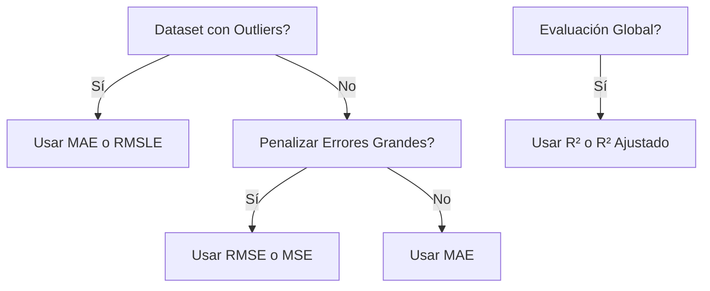
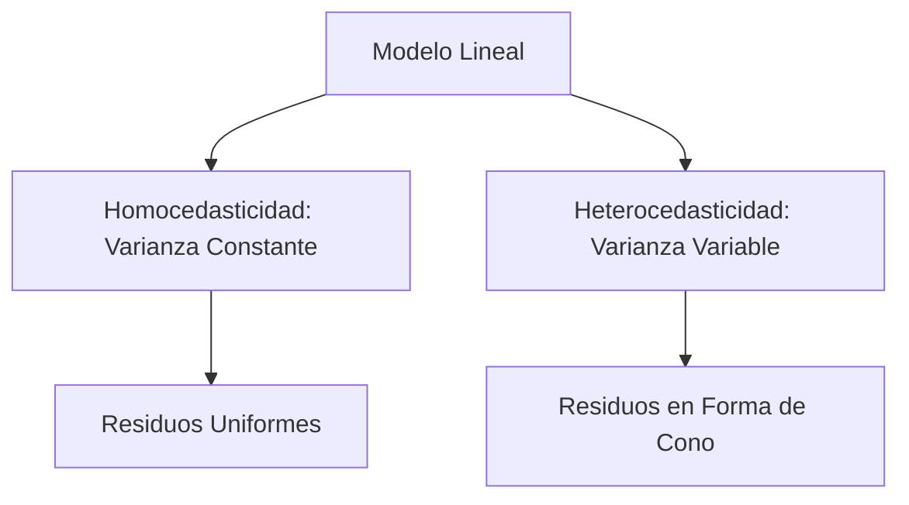
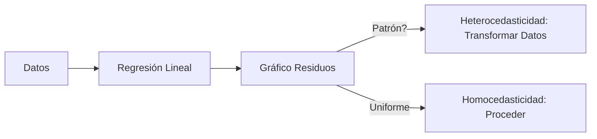
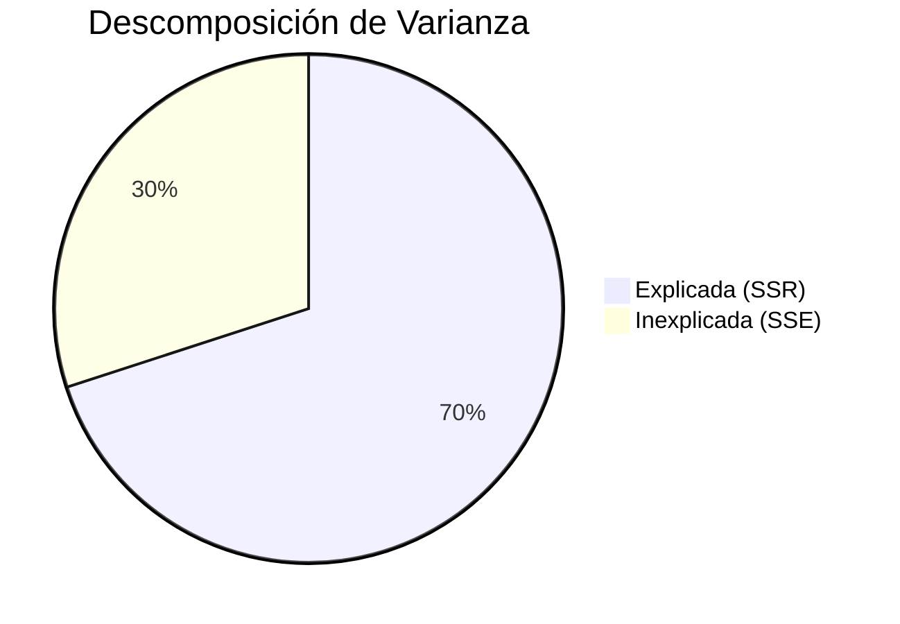
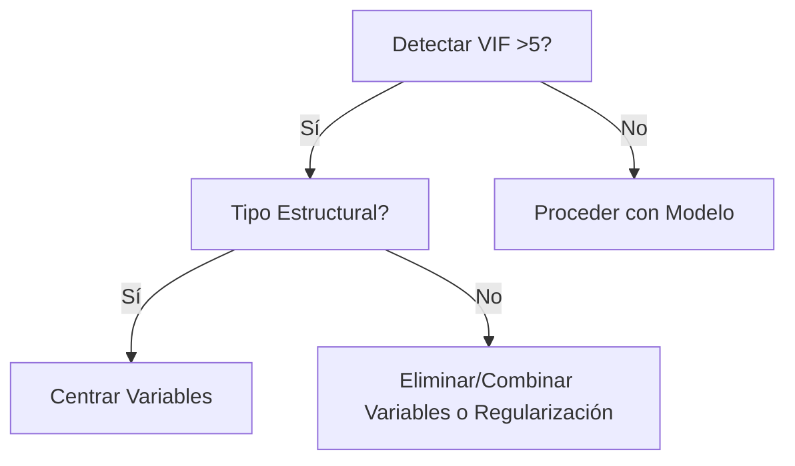

# Métricas en Regresión: Métricas en regresión (P) (1).pdf

## Introducción a las Métricas en Modelos de Regresión

Las métricas en regresión son herramientas esenciales para evaluar el rendimiento de un modelo predictivo. Permiten cuantificar el error entre las predicciones y los valores reales, ayudando a entender cuán preciso es el modelo y si se ajusta adecuadamente a los datos. Aunque muchas personas se limitan a unas pocas métricas por desconocimiento, es crucial explorar las disponibles para seleccionar la más adecuada según el contexto, como la presencia de outliers o la escala de los datos. Este documento detalla las métricas principales, sus fórmulas, ventajas, desventajas y escenarios de uso óptimo.

### Concepto Básico de Error en Regresión
El error representa la diferencia entre el valor predicho por el modelo ($ \hat{y}_i $) y el valor real observado ($ y_i $). En una regresión lineal, el modelo ajusta una línea que minimiza estos errores. Las métricas agregan estos errores individuales para proporcionar una medida global de rendimiento.

```mermaid
graph LR
    A[Valor Real $ y_i $] -- Diferencia --> B[Error $ e_i = y_i - \hat{y}_i $]
    B --> C[Métrica Agregada (e.g., MAE, RMSE)]
    subgraph Gráfico de Regresión
    D[Puntos de Datos] --> E[Línea Ajustada]
    end
```

## Métricas Principales

### Error Absoluto Medio (MAE)
El MAE mide la diferencia promedio absoluta entre valores predichos y reales, evitando que errores positivos y negativos se cancelen.

- **Fórmula**:
  $$
  MAE = \frac{1}{n} \sum_{i=1}^{n} |y_i - \hat{y}_i|
  $$
- **Ventajas**: Robusto a outliers; fácil de interpretar (en unidades originales).
- **Desventajas**: No penaliza errores grandes; no diferenciable en cero, lo que complica optimizaciones.
- **Cuándo usarlo**: Datasets con outliers; cuando se busca una métrica intuitiva sin penalización excesiva.

Ejemplo: Con valores reales [3, 2.5, -2, 2.3, 4, 7.2, 8.1] y predichos [3.1, 2.5, -2.5, 2.45, 3.8, 7.8, 7.9], MAE ≈ 0.249.

### Error Cuadrático Medio (MSE)
El MSE eleva al cuadrado las diferencias para penalizar errores grandes, midiendo la cercanía de la línea de ajuste a los datos.

- **Fórmula**:
  $$
  MSE = \frac{1}{n} \sum_{i=1}^{n} (y_i - \hat{y}_i)^2
  $$
- **Ventajas**: Diferenciable, útil en optimizaciones; penaliza outliers.
- **Desventajas**: En unidades cuadradas, difícil de interpretar; sensible a outliers.
- **Cuándo usarlo**: Optimización de modelos (e.g., descenso de gradiente); cuando se prioriza penalizar errores grandes.

En el ejemplo anterior, MSE ≈ 0.103.

### Raíz del Error Cuadrático Medio (RMSE)
Raíz cuadrada del MSE, para interpretar en unidades originales.

- **Fórmula**:
  $$
  RMSE = \sqrt{\frac{1}{n} \sum_{i=1}^{n} (y_i - \hat{y}_i)^2}
  $$
- **Ventajas**: Interpretable; penaliza errores grandes.
- **Desventajas**: Sensible a outliers; no maneja bien escalas logarítmicas.
- **Cuándo usarlo**: Comparación de modelos; preferible sobre MSE para interpretabilidad.

En el ejemplo, RMSE ≈ 0.321.

### Raíz del Error Logarítmico Cuadrático Medio (RMSLE)
Aplica logaritmo para manejar escalas y outliers.

- **Fórmula**:
  $$
  RMSLE = \sqrt{\frac{1}{n} \sum_{i=1}^{n} [\log(y_i + 1) - \log(\hat{y}_i + 1)]^2}
  $$
- **Ventajas**: Robusto a outliers; útil en datos con rangos amplios (e.g., precios).
- **Desventajas**: No maneja valores negativos; requiere transformación.
- **Cuándo usarlo**: Predicciones con variabilidad alta o escalas exponenciales.

En el ejemplo, RMSLE ≈ 0.004.

### Porcentaje de Error Absoluto Medio (MAPE)
Expresa el error como porcentaje.

- **Fórmula**:
  $$
  MAPE = \frac{100}{n} \sum_{i=1}^{n} \left| \frac{y_i - \hat{y}_i}{y_i} \right|
  $$
- **Ventajas**: Escala independiente; fácil de interpretar.
- **Desventajas**: Indefinido si $ y_i = 0 $; sensible a valores pequeños.
- **Cuándo usarlo**: Pronósticos (e.g., ventas); cuando se necesita porcentaje.

En el ejemplo, MAPE ≈ 7.23%.

### Coeficiente de Determinación (R²)
Mide la proporción de varianza explicada por el modelo.

- **Fórmula**:
  $$
  R^2 = 1 - \frac{\sum (y_i - \hat{y}_i)^2}{\sum (y_i - \bar{y})^2}
  $$
- **Ventajas**: Indica ajuste global (0 a 1).
- **Desventajas**: Aumenta con más variables, incluso irrelevantes.
- **Cuándo usarlo**: Evaluación general; comparar modelos simples.

En el ejemplo, R² ≈ 0.989.

### R² Ajustado
Penaliza por variables adicionales.

- **Fórmula**:
  $$
  R^2_{\text{ajustado}} = 1 - \frac{(1 - R^2)(n - 1)}{n - k - 1}
  $$
  (Donde $ k $ es el número de predictores).
- **Ventajas**: Corrige por sobreajuste.
- **Desventajas**: Complejo en modelos no lineales.
- **Cuándo usarlo**: Regresión múltiple; selección de variables.

En el ejemplo, R² ajustado ≈ 0.987.

## Comparación de Métricas

| Métrica | Penaliza Outliers | Interpretable | Diferenciable | Uso Principal |
|---------|-------------------|---------------|---------------|---------------|
| MAE     | No                | Sí            | No            | Robustez a outliers |
| MSE     | Sí                | No (cuadrado) | Sí            | Optimización |
| RMSE    | Sí                | Sí            | Sí            | Predicciones generales |
| RMSLE   | Moderado          | Sí (log)      | Sí            | Datos escalados |
| MAPE    | Moderado          | Sí (%)        | No            | Pronósticos |
| R²      | N/A               | Sí (0-1)      | N/A           | Ajuste global |
| R² Ajustado | N/A           | Sí (0-1)      | N/A           | Regresión múltiple |



## Mejoras y Expansiones
- **Correcciones**: El documento original menciona RMSLE con log(y+1) para evitar logs negativos, lo cual es correcto, pero ampliemos: útil en competiciones como Kaggle para métricas relativas.
- **Ampliaciones**: Considerar métricas avanzadas como Huber Loss para robustez híbrida. En práctica, usar bibliotecas como scikit-learn para cálculos automáticos. Siempre validar con cross-validation para evitar sobreajuste.

# Homocedasticidad vs Heterocedasticidad: Homocedasticidad vs Heterocedasticidad (1).pdf

## Introducción a Homocedasticidad y Heterocedasticidad

En estadística y modelado de regresión, la "cedasticidad" se refiere a la varianza de los errores (residuos). La homocedasticidad implica varianza constante de los errores a lo largo de los valores de la variable independiente, mientras que la heterocedasticidad indica varianza variable. Estos conceptos son cruciales para validar supuestos en regresión lineal, ya que violaciones afectan la robustez de inferencias y predicciones.

### Definiciones
- **Homocedasticidad**: La varianza de los errores ($ \epsilon_i $) es constante para todos los niveles de la variable independiente ($ x_i $). En un modelo $ y_i = \beta_0 + \beta_1 x_i + \epsilon_i $, $ \Var(\epsilon_i) = \sigma^2 $ (constante).
- **Heterocedasticidad**: La varianza de los errores cambia con $ x_i $, e.g., $ \Var(\epsilon_i) = f(x_i) $, como $ x_i^2 $.



### Ejemplos Visuales
- **Homocedasticidad**: Residuos distribuidos uniformemente alrededor de la línea de regresión (líneas discontinuas paralelas).
- **Heterocedasticidad**: Residuos que se expanden o contraen, formando un patrón (e.g., abanico).

Ejemplo en Python para homocedasticidad:
```python
import pandas as pd
import numpy as np
from random import random
import statsmodels.formula.api as smf

X = [random() for _ in range(300)]
Y = [5*x + 3*random() for x in X]  # Varianza constante
data = pd.DataFrame({'X': X, 'Y': Y})
model = smf.ols('Y ~ X', data=data).fit()
# Gráfico mostraría puntos uniformes
```

Para heterocedasticidad, modificar para que errores crezcan con x.

### Consecuencias
- **Homocedasticidad**: Cumple supuestos de OLS; estimadores eficientes y no sesgados.
- **Heterocedasticidad**: Infla errores estándar; pruebas de significancia poco fiables; modelo menos robusto.

### Detección y Soluciones
- **Detección**: Gráficos de residuos vs. predichos; pruebas como Breusch-Pagan o White.
- **Soluciones**: Transformaciones (e.g., logaritmo en y); modelos robustos (e.g., WLS); verificación post-regresión.



## Mejoras y Expansiones
- **Correcciones**: El documento usa "homocedástico" correctamente; ampliemos con que en series temporales, ARCH/GARCH manejan heterocedasticidad condicional.
- **Ampliaciones**: En machine learning, métricas como MAE son menos sensibles. Usar paquetes como statsmodels en Python para pruebas automáticas.

# Dominando Modelos de Regresión: Mastering Regression Models (1).pdf

## Estimación de Parámetros en Modelos de Regresión

En regresión lineal simple, los parámetros verdaderos $ \beta_0 $ y $ \beta_1 $ son desconocidos y se estiman a partir de datos muestrales. Este documento cubre el método de mínimos cuadrados (least squares), residuos, varianza estimada y pruebas de hipótesis para validar el modelo.

### Principio de Mínimos Cuadrados
El objetivo es minimizar la suma de cuadrados de los errores:
$$
f(b_0, b_1) = \sum_{i=1}^{n} [y_i - (b_0 + b_1 x_i)]^2
$$
Los estimadores son:
$$
\hat{\beta_1} = \frac{S_{xy}}{S_{xx}}, \quad \hat{\beta_0} = \bar{y} - \hat{\beta_1} \bar{x}
$$
Donde $ S_{xy} = \sum x_i y_i - \frac{(\sum x_i)(\sum y_i)}{n} $, $ S_{xx} = \sum x_i^2 - \frac{(\sum x_i)^2}{n} $.

### Valores Ajustados y Residuos
- **Valores Ajustados ($ \hat{y_i} $)**: Predicciones del modelo.
- **Residuos ($ e_i $)**: $ e_i = y_i - \hat{y_i} $. Su suma es cero en least squares.

### Estimación de la Varianza ($ \sigma^2 $)
$$
SSE = \sum (y_i - \hat{y_i})^2, \quad s^2 = \frac{SSE}{n-2}
$$
SSE mide variación inexplicada.

### Descomposición de la Varianza
- **SST (Total)**: $ SST = \sum (y_i - \bar{y})^2 $
- **SSR (Regresión)**: $ SSR = SST - SSE $
- **Coeficiente de Determinación (R²)**: $ R^2 = \frac{SSR}{SST} $



### Pruebas de Hipótesis
- **Enfoques**: Valor crítico, p-valor, intervalo de confianza, ratio de verosimilitud, bayesiano.
- **Estadísticos**: z-score, t-statistic, F-statistic, chi-cuadrado.

Ejemplo t-statistic:
$$
t = \frac{\hat{\beta_1} - 0}{s / \sqrt{S_{xx}}}
$$

## Mejoras y Expansiones
- **Correcciones**: Traducido del inglés; enfatizar supuestos como normalidad de errores.
- **Ampliaciones**: En práctica, usar software como R o Python (statsmodels). Considerar multicolinealidad en regresión múltiple.

# Qué es la Multicolinealidad y por Qué es un Problema: Qué es la multicolinealidad y por qué es un problema (P) (1).pdf

## Introducción a la Multicolinealidad

La multicolinealidad ocurre cuando variables independientes en regresión están altamente correlacionadas, complicando la interpretación de efectos individuales. Deriva de "multi" (múltiples), "col" (junto), "linear" (lineal) e "ity" (estado). Afecta la estabilidad de coeficientes y pruebas estadísticas.

### Tipos
- **De Datos**: Correlaciones inherentes (e.g., población y PIB).
- **Estructural**: Por términos agregados (e.g., interacciones edad*dosis).

| Tipo | Origen | Ejemplo |
|------|--------|---------|
| De Datos | Datos crudos | Población y PIB en países |
| Estructural | Modelo | Interacción en regresión |

### Consecuencias
- Coeficientes inestables.
- Errores estándar inflados.
- p-valores poco fiables.

### Detección
- Matriz de correlación.
- Factor de Inflación de Varianza (VIF): VIF=1 (ninguna), 1-5 (moderada), >5 (crítica).

### Soluciones
- **Estructural**: Centrar variables (restar media).
- **De Datos**: Eliminar variables, PCA, regresiones regularizadas (Ridge, LASSO).


