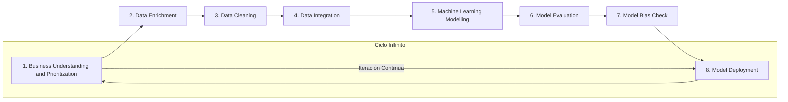
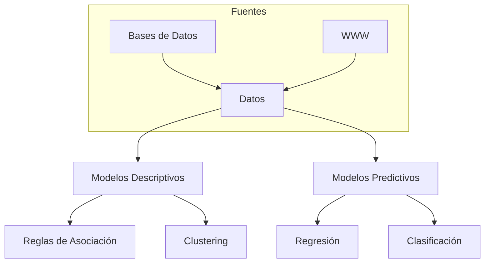
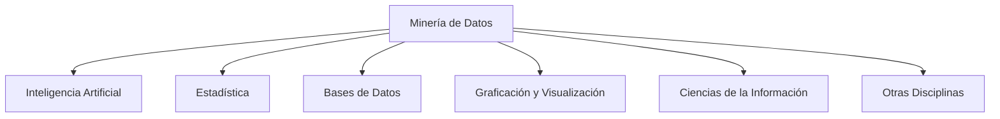
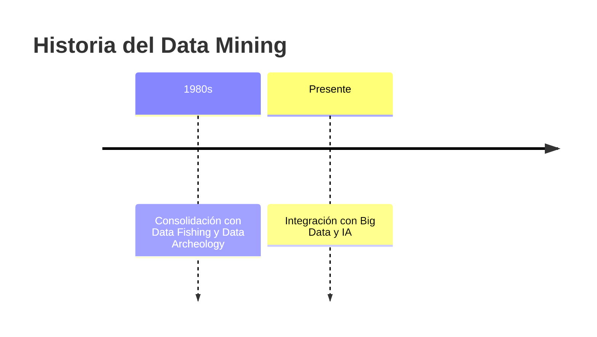
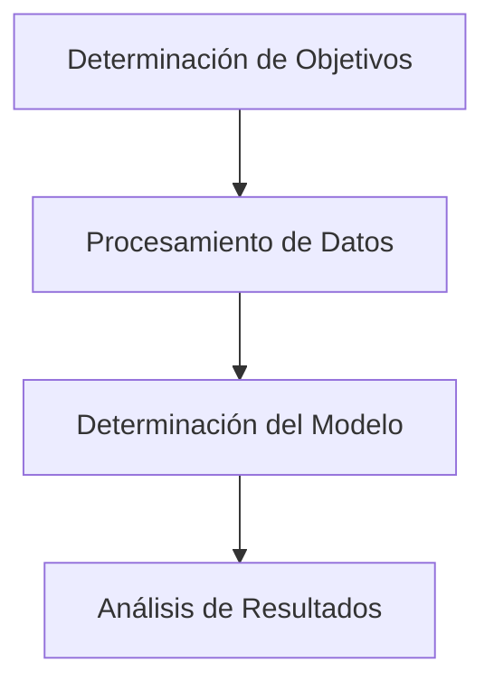

# Data LifeCycle.pdf: Ciclo de Vida de los Datos

## Introducción al Ciclo de Vida de los Datos

El ciclo de vida de los datos representa el proceso iterativo y continuo mediante el cual los datos son gestionados desde su concepción hasta su utilización práctica en modelos analíticos. Este ciclo, a menudo ilustrado como un bucle infinito, enfatiza la naturaleza cíclica del manejo de datos en entornos de minería de datos y aprendizaje automático. El diagrama proporcionado en el documento destaca ocho etapas clave, asegurando que los datos sean refinados, modelados y desplegados de manera efectiva para apoyar decisiones empresariales.

### Etapas Principales del Ciclo de Vida

- **Business Understanding and Prioritization**: Identificar los objetivos empresariales y priorizar las necesidades de datos. Esta etapa implica comprender el contexto del negocio, definir problemas específicos y alinear los esfuerzos de datos con metas estratégicas. Por ejemplo, determinar si el foco está en predecir churn de clientes o optimizar inventarios.
  
- **Data Enrichment**: Enriquecer los datos existentes mediante la incorporación de fuentes adicionales. Esto incluye la integración de datos externos, como APIs o bases de datos complementarias, para aumentar la profundidad y relevancia. Mejora la calidad al agregar variables que podrían revelar patrones ocultos.

- **Data Cleaning**: Limpiar los datos para eliminar errores, duplicados, valores atípicos o inconsistencias. Técnicas comunes incluyen el manejo de valores faltantes (imputación), normalización y detección de outliers. Esta etapa es crucial para evitar sesgos en modelos subsiguientes.

- **Data Integration**: Integrar datos de múltiples fuentes en un conjunto unificado. Involucra la resolución de conflictos de formato, esquemas y semántica, utilizando herramientas como ETL (Extract, Transform, Load). Asegura una vista holística de los datos.

- **Machine Learning Modelling**: Desarrollar modelos de aprendizaje automático basados en los datos preparados. Incluye la selección de algoritmos (e.g., regresión, clustering) y entrenamiento inicial. El enfoque está en crear modelos que capturen patrones predictivos o descriptivos.

- **Model Evaluation**: Evaluar el rendimiento del modelo utilizando métricas como precisión, recall, F1-score o RMSE. Implica técnicas como validación cruzada para asegurar generalización y evitar sobreajuste.

- **Model Bias Check**: Verificar sesgos en el modelo, como discriminación por género o raza. Utiliza auditorías de equidad y métricas como disparate impact para mitigar riesgos éticos y legales.

- **Model Deployment**: Desplegar el modelo en producción, integrándolo en sistemas operativos. Incluye monitoreo continuo, actualizaciones y escalabilidad para manejar cargas reales.

### Representación Visual del Ciclo

El diagrama adopta una forma de infinito (∞), simbolizando la iteratividad: los resultados de deployment pueden retroalimentar nuevas priorizaciones empresariales.

## Mejoras y Expansiones

- **Importancia en Minería de Datos**: Este ciclo alinea con estándares como CRISP-DM, extendiendo el enfoque a sesgos y despliegue, críticos en era de IA ética.
- **Herramientas Recomendadas**:
  - Limpieza: Pandas, OpenRefine.
  - Modelado: Scikit-learn, TensorFlow.
  - Despliegue: Docker, Kubernetes.
- **Desafíos Comunes**: Manejo de datos sensibles (cumplimiento GDPR), escalabilidad en big data y mantenimiento de modelos en entornos dinámicos.

# Acerca de la Minería de Datos.pdf: Introducción a la Minería de Datos

## Definiciones Iniciales

La minería de datos se basa en conceptos fundamentales que distinguen entre datos crudos y conocimiento derivado.

- **Datos**: Hechos o medidas que describen características de objetos, eventos o personas. Representan la materia prima para obtener información.
- **Información**: Datos analizados y presentados de forma adecuada, relevantes para un observador en un momento específico.
- **Conocimiento**: Información procesada para emitir juicios que llevan a conclusiones.
- **Meta Conocimiento**: Reglas que permiten obtener conocimiento.

### Características Principales de la Información

- **Significado (Semántica)**: ¿Qué quiere decir? Influye en las actitudes y acciones basadas en consecuencias previsibles.
- **Importancia (Relativa al Receptor)**: ¿Trata sobre una cuestión importante? Mide el cambio en actitud o conducta.
- **Vigencia (Dimensión Espacio-Tiempo)**: ¿Es actual o desfasada? Difícil de evaluar sin contexto adicional.
- **Validez (Relativa al Emisor)**: ¿El emisor es fiable? ¿Puede entregar información no válida?
- **Valor (Receptor)**: ¿Cuán útil resulta para el destinatario?

## Situación Actual de los Datos

La revolución digital ha facilitado la captura y almacenamiento de datos a bajo costo, generando volúmenes masivos en bases de datos diarias. Sin embargo, las herramientas tradicionales de gestión y estadísticas son inadecuadas para analizar estos datos. Los datos solos no producen beneficios; su valor radica en extraer información para la toma de decisiones. Procesos manuales son irrealizables con bases de datos de 10^9 registros y 10^3 dimensiones. La minería de datos automatiza este proceso.

## Conocimiento: Modelo vs. Patrón

Según Hand, Mannila y Smyth:
- **Modelo**: Describe todo el conjunto de datos (e.g., una línea de regresión global).
- **Patrón**: Se enfoca en una región particular de datos (e.g., un outlier o subgrupo).

### Fuentes de Datos y Tipos de Modelos

- **Fuentes de Datos**:
  - Bases de datos (relacionales, espaciales, temporales, documentales, multimedia).
  - World Wide Web.

- **Modelos Descriptivos**: Identifican patrones que explican o resumen datos.
  - Reglas de asociación.
  - Clustering.

- **Modelos Predictivos**: Estiman valores de variables de interés a partir de otras.
  - Regresión.
  - Clasificación.

## Visión Simplificada de la Minería de Datos

Los modelos son el producto principal de la minería de datos, soportando estrategias de decisión.

## Definiciones de Minería de Datos

- Proceso de identificar conocimiento válido, novedoso, útil y comprensible de bases de datos (Fayyad et al., 1996).
- Exploración y análisis de grandes cantidades de datos para encontrar patrones significativos.
- Mecanismo de búsqueda de información valiosa en volúmenes masivos, ligado a bodegas de datos históricas.
- Análisis para encontrar relaciones no triviales y resumir datos de manera entendible (Hand, Mannila y Smyth).
- Extracción de patrones interesantes y útiles de grandes bases de datos (Hand).
- Proceso de extraer conocimiento útil y comprensible de datos en diversos formatos (Witten and Frank, 2000).
- Proceso no trivial de identificar patrones válidos, novedosos y comprensibles (KDD).

## Lo que Es y No Es Minería de Datos

- **Sí Es**:
  - Proceso de inferir relaciones importantes de datos crudos.
  - Colección de técnicas para analizar volúmenes grandes.
  - Conjunto de técnicas que descubren relaciones no previamente conocidas.
  - Palabra de moda para técnicas que encuentran patrones.

- **No Es**:
  - Búsqueda simple en directorios o motores de búsqueda.
  - Fuerza bruta en datos a granel.
  - Presentación de datos en diferentes formas.
  - Tarea intensiva de base de datos básica.

## Campo Multidisciplinario

La minería de datos integra:
- Inteligencia Artificial (Machine Learning).
- Estadística.
- Bases de Datos.
- Graficación y Visualización.
- Ciencias de la Información.
- Otras disciplinas.

## Minería de Datos vs. Estadística

| Aspecto          | Estadística                          | Minería de Datos                     |
|------------------|--------------------------------------|--------------------------------------|
| Construcción de Modelos | Ceñida a premisas y teoremas        | Mayor libertad, interpretable        |
| Búsqueda         | Test de la razón de verosimilitud   | Metaheurísticos                      |
| Transparencia    | Más complicados de interpretar      | Más claros y sencillos               |
| Validación       | No                                  | Sí                                   |

Adicionalmente, la minería maneja mayor volumen y complejidad de datos, enfatizando la búsqueda de modelos sobre la verificación.

## OLAP vs. Minería de Datos

| OLAP Example                          | Minería de Datos Example              |
|---------------------------------------|--------------------------------------|
| ¿Proporción media de accidentes entre fumadores/no fumadores? | ¿Mejor predicción para accidentes?   |
| ¿Factura telefónica media de clientes/abandonados? | ¿Dejará X la compañía? ¿Factores que afectan abandonos? |
| ¿Compra media diaria de tarjetas robadas/légitimas? | ¿Patrones de compra asociados con fraude? |

OLAP ofrece vistas descriptivas actuales, pero no predice futuro ni explica causas.

## Clasificación de la Minería de Datos

- **Métodos Descriptivos**: Encuentran patrones interpretables que describen datos.
- **Métodos de Predicción**: Usan variables para predecir valores desconocidos o futuros.

Se divide en:
- Minería Predictiva (MDP): Primordialmente técnicas estadísticas.
- Minería para Descubrimiento de Conocimiento (MDDC): Principalmente inteligencia artificial.

## Mejoras y Expansiones

- **Aplicaciones Prácticas**: En marketing para segmentación, en salud para diagnósticos predictivos.
- **Desafíos Éticos**: Privacidad de datos, sesgos en modelos.
- **Tendencias Actuales**: Integración con big data, cloud computing y ética en IA.

# Qué es Data Mining.pdf: ¿Qué es el Data Mining?

## Definición y Propósito

El Data Mining, o Minería de Datos, es un campo de la estadística y ciencias de la computación que involucra procesos automáticos o semiautomáticos para explorar grandes conjuntos de datos. Su objetivo es identificar patrones, anomalías y comportamientos que expliquen los datos, facilitando estrategias empresariales como adquisición y fidelización de clientes.

La creación de grandes bases de datos genera "infoxicación"; el Data Mining estructura estos datos para extraer valor, prediciendo tendencias y mejorando decisiones.

### Historia

Aunque parece reciente, se consolidó en los 80s junto con Data Fishing y Data Archeology. Surgió para comprender volúmenes masivos de datos y apoyar el crecimiento empresarial.

## Minero de Datos

Los profesionales, conocidos como "Mineros o Exploradores de Datos", descubren patrones en masas de datos para proporcionar información valiosa. Pasos clave:

- **Determinación de Objetivos**: El cliente define metas.
- **Procesamiento de Datos**: Selección, limpieza, organización y reducción.
- **Determinación del Modelo**: Estudio estadístico y visualización gráfica.
- **Análisis de Resultados**: Identificar coherencia y utilidad.

Aplicado en salud, banca, medios y retail; una profesión con alta proyección.

## Data Mining vs. Big Data

Ambos manejan grandes datos, pero difieren:

- **Objetivos**: Big Data se enfoca en almacenamiento; Data Mining en extracción de valor.
- **Herramientas**: Data Mining usa IA y estadísticas; Big Data requiere software no convencional.
- **Resultados**: Data Mining produce modelos predictivos; Big Data complica predicciones sin herramientas especiales.

Big Data es el "activo"; Data Mining, el "manejo".

| Aspecto      | Big Data                  | Data Mining               |
|--------------|---------------------------|---------------------------|
| Herramientas | Software no convencional | IA y Métodos Estadísticos |
| Resultados   | Gestión de información   | Modelos predictivos       |

## Ejemplos de Uso

- **Marketing**: Analizar parámetros (edad, género, gustos) para predecir comportamiento y churn.
- **Supermercados**: Identificar asociaciones de productos y optimizar colocación para aumentar ventas.
- **Bancos**: Analizar transacciones, patrones de compra para evaluar riesgos y preferencias.
- **Medicina**: Usar historiales para diagnósticos precisos y agilizar gestión administrativa.

