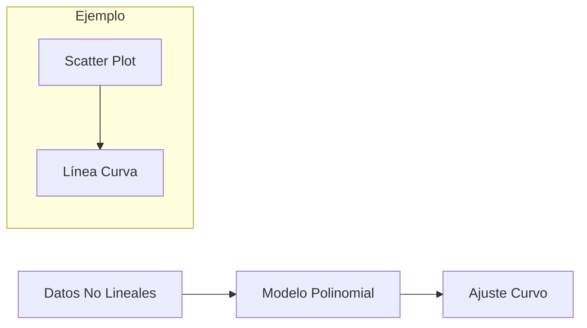

# Semana 1 - Sesión 2: Minería de Datos - Regresión Lineal y Optimización

## Regresión Lineal: Función Hipótesis y Parámetros

La regresión lineal es un modelo predictivo que establece una relación lineal entre una variable independiente (feature) y una variable dependiente (target). En su forma univariada, se basa en una sola feature para estimar el target.

### Componentes Principales
- **Función Hipótesis**: Representa la aproximación del modelo a la relación verdadera entre las variables. Se define como:  
  $h_\theta(x) = \theta_0 + \theta_1 x$  
  donde $x$ es la variable de entrada, $\theta_0$ es el término de sesgo (intercepto) y $\theta_1$ es el coeficiente de pendiente (peso). Esta función también se puede denotar como una aproximación lineal $L(x) = \omega_0 + \omega_1 x$, usando notación alternativa para los parámetros.
  
- **Parámetros**: $\theta_0$ y $\theta_1$ son los valores ajustables que el algoritmo optimiza para minimizar el error de predicción. Estos parámetros se inicializan típicamente con valores aleatorios o ceros, y se refinan iterativamente.

### Matriz de Diseño
Para generalizar a múltiples muestras, se utiliza la matriz de diseño $X$, que incluye una columna agregada de unos para el término de sesgo:  
- Si hay $m$ muestras y $n$ features (en univariado, $n = 1$), $X$ es una matriz de $m \times (n+1)$.  
- La hipótesis vectorizada se expresa como: $h_\theta(x) = \theta^T x$, donde $\theta$ es el vector de parámetros.

Ejemplo de matriz de diseño para 3 muestras:  
| 1 | x₁ |  
| 1 | x₂ |  
| 1 | x₃ |  

```mermaid
graph LR
    A[Matriz X con columna de 1s] --> B[Multiplicar por θ^T]
    B --> C[Predicciones h_θ(x)]
    subgraph Vectorización
    A
    B
    end
```

## Función de Costo y Objetivo de Optimización

La función de costo evalúa cuán bien el modelo ajusta los datos de entrenamiento, midiendo la discrepancia entre predicciones y valores reales.

### Definición
- **Función de Costo (Error Cuadrático Medio)**:  
  $J(\theta_0, \theta_1) = \frac{1}{2m} \sum_{i=1}^{m} (h_\theta(x^{(i)}) - y^{(i)})^2$  
  donde $m$ es el número de muestras, $x^{(i)}$ es la i-ésima feature y $y^{(i)}$ es el target correspondiente. El factor $\frac{1}{2}$ facilita las derivadas.

### Propiedades de la Superficie de Costo
- **Mínimos Locales**: Puntos donde el costo es menor que en los vecinos inmediatos, pero no necesariamente el óptimo global. Pueden ocurrir en funciones no convexas.
- **Mínimo Global**: El punto de costo más bajo absoluto, que representa el mejor ajuste posible. Para la regresión lineal, $J(\theta)$ es convexa, garantizando un único mínimo global.

### Objetivo
Minimizar $J(\theta_0, \theta_1)$ ajustando los parámetros para que las predicciones se acerquen lo máximo posible a los valores reales.

```mermaid
graph TD
    A[Superficie de Costo J(θ)] --> B[Mínimo Local]
    A --> C[Mínimo Global]
    subgraph Gráfico 3D Convexo
    D[Eje θ₀] -- Eje θ₁ --> E[Valores de J]
    end
```

## Derivación de la Función de Costo

Para optimizar, se derivan las parciales de $J$ respecto a cada parámetro. A continuación, se muestra la expansión detallada:

- Expansión inicial:  
  $J(\theta_0, \theta_1) = \frac{1}{2m} \sum_{i=1}^{m} \left[ (\theta_0 + \theta_1 x_i)^2 - 2(\theta_0 + \theta_1 x_i) y_i + y_i^2 \right]$  
  $= \frac{1}{2m} \sum_{i=1}^{m} \left( \theta_0^2 + 2\theta_0 \theta_1 x_i + \theta_1^2 x_i^2 - 2\theta_0 y_i - 2\theta_1 x_i y_i + y_i^2 \right)$

- Derivada parcial respecto a $\theta_0$:  
  $\frac{\partial J}{\partial \theta_0} = \frac{1}{m} \sum_{i=1}^{m} (h_\theta(x_i) - y_i)$

- Derivada parcial respecto a $\theta_1$:  
  $\frac{\partial J}{\partial \theta_1} = \frac{1}{m} \sum_{i=1}^{m} (h_\theta(x_i) - y_i) x_i$

Estas derivadas representan el gradiente, que indica la dirección de mayor aumento en el costo.

## Algoritmo del Descenso del Gradiente

El descenso del gradiente es un método iterativo para encontrar el mínimo de la función de costo ajustando los parámetros en la dirección opuesta al gradiente.

### Fórmula de Actualización
- Para cada parámetro $j$:  
  $\theta_j := \theta_j - \alpha \frac{\partial J}{\partial \theta_j}$  
  donde $\alpha$ es la tasa de aprendizaje (learning rate), un hiperparámetro en $[0, 1]$ o valores pequeños positivos. Se actualiza simultáneamente para todos los $\theta_j$.

- Aplicación específica:  
  - Para $j = 0$: $\theta_0 := \theta_0 - \alpha \frac{1}{m} \sum_{i=1}^{m} (h_\theta(x_i) - y_i)$  
  - Para $j = 1$: $\theta_1 := \theta_1 - \alpha \frac{1}{m} \sum_{i=1}^{m} (h_\theta(x_i) - y_i) x_i$

### Efecto de la Tasa de Aprendizaje ($\alpha$)
- **$\alpha$ Pequeño**: Conduce a una convergencia lenta pero estable, ya que los pasos son cautelosos. Ideal para evitar overshooting, pero puede requerir muchas iteraciones.
- **$\alpha$ Grande**: Puede causar oscilaciones o divergencia, ya que los pasos saltan sobre el mínimo. En casos extremos, el algoritmo no converge.

### Consideraciones Prácticas
- Inicialización: Comúnmente, $\theta_0 = 0$ o 1, y otros parámetros en cero.
- Convergencia: Monitorear si el cambio en $J$ es menor a un umbral (e.g., 0.001) o tras un número fijo de iteraciones.
- Escalado: Normalizar features para que converja más rápido, especialmente con múltiples features.

```mermaid
flowchart LR
    A[Inicializar θ] --> B[Calcular ∂J/∂θ_j]
    B --> C[Actualizar θ_j = θ_j - α * ∂J/∂θ_j]
    C --> D[Evaluar J(θ)]
    D -- No convergido --> B
    D -- Converge --> E[Parámetros Óptimos]
```

## Ecuación Normal: Solución Analítica

Para datasets pequeños, se puede resolver directamente sin iteraciones usando la ecuación normal, que proporciona la solución cerrada para el mínimo global.

### Fórmula
- $\theta = (X^T X)^{-1} X^T Y$  
  donde $X$ es la matriz de diseño, $X^T$ su transpuesta, e $Y$ el vector de targets. Requiere que $X^T X$ sea invertible (no singular).

### Ventajas y Desventajas
- **Ventajas**: Exacta y no requiere hiperparámetros como $\alpha$. Rápida para $m$ pequeño.
- **Desventajas**: Computacionalmente costosa para grandes $m$ o $n$ (complejidad $O(n^3)$ para la inversión). No maneja bien matrices no invertibles sin regularización.

## Incorporación de Notas Adicionales de los Apuntes Manuscritos

Los apuntes manuscritos proporcionados refuerzan y expanden los conceptos anteriores, con énfasis en visualizaciones y ejemplos prácticos. Se evitan redundancias al integrar solo elementos nuevos o aclaratorios:

### Categorías de Datos (Repaso Ampliado)
- **Datos Estructurados**: Tabulares (e.g., tablas en bases de datos).
- **Datos Semi-estructurados**: Con estructura flexible (e.g., HTML, XML, JSON).
- **Datos No Estructurados**: Sin formato fijo (e.g., MP3, videos, texto libre).

### Relaciones con Otras Áreas
- **Business Intelligence (BI)**: Incluye herramientas como SQL Server BI (SSIS para integración, SSAS para análisis, SSRS para reporting), Tableau y Power BI.
- **Analytics**: Enfocado en conocimiento a partir de datos para decisiones.
- **Knowledge Discovery in Databases (KDD)**: Proceso iterativo que abarca la minería de datos.

### Ejemplos Visuales en Regresión
- Gráficos de dispersión para datos (e.g., área vs. precio).
- Superficie de costo con mínimos locales/globales.
- Líneas de regresión ajustadas.

### Regresión Polinomial (Extensión Mencionada)
- Hipótesis: $h_\theta(x) = \theta_0 + \theta_1 x + \theta_2 x^2 + \dots$
- Útil para relaciones no lineales, pero propenso a sobreajuste.


